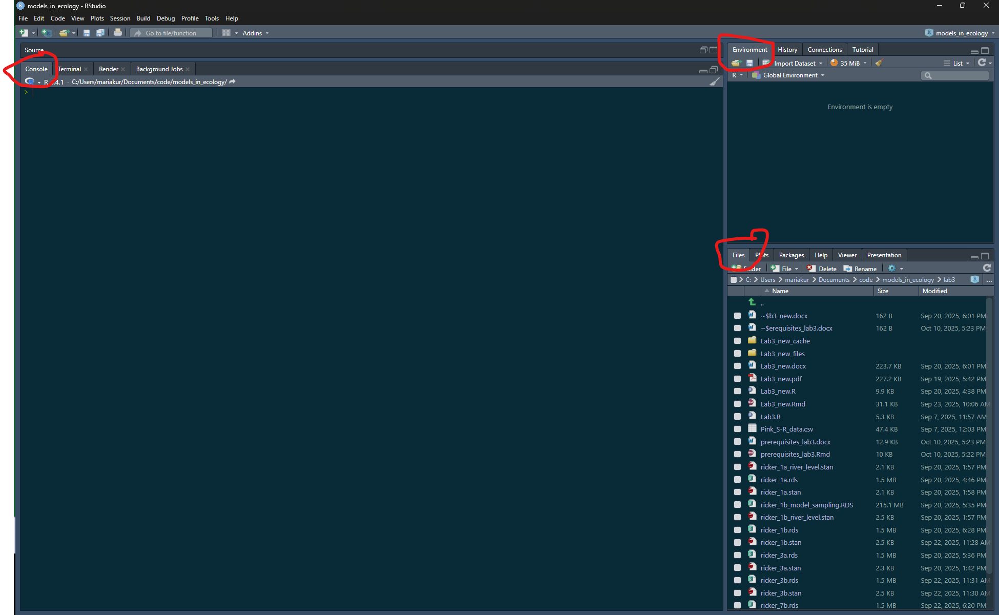
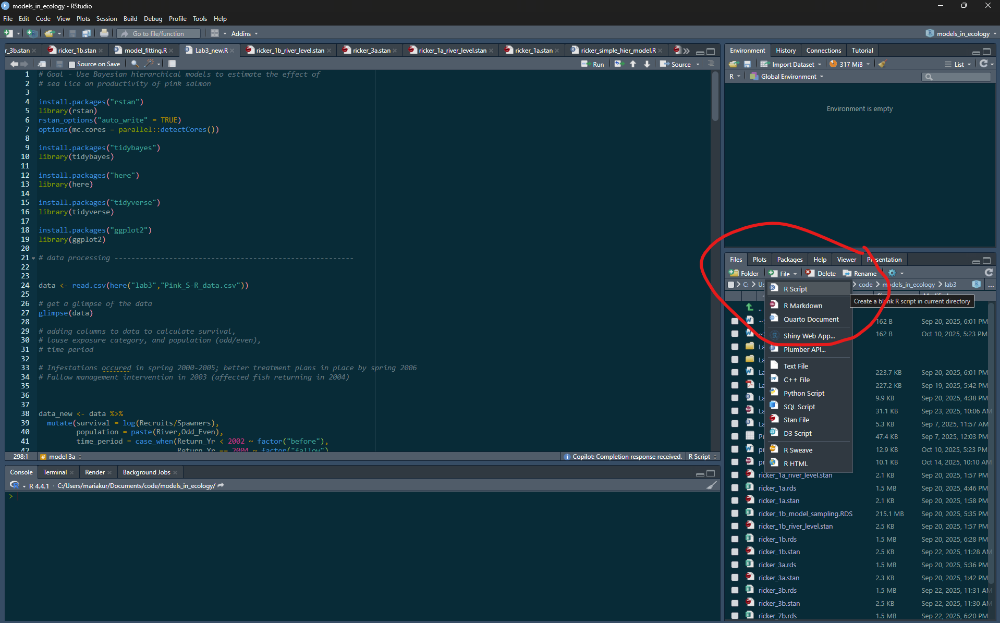

<!-- Make a new document for Lab 3 - redo analysis fromKrkosek and Hilborn 2011 in a Bayesian framework  -->

```{=html}
<style type="text/css">

body{ /* Normal  */
      font-size: 13px;
  }
td {  /* Table  */
  font-size: 13px;
}
h1.title {
  font-size: 24px;
  color: Black;
}
h1 { /* Header 1 */
  font-size: 19px;
  color: Black;
}
h2 { /* Header 2 */
    font-size: 15px;
  color: Black;
}
h3 { /* Header 3 */
    font-size: 15px;
  color: Black;
}
</style>
```


```{r setup, include=FALSE}
knitr::opts_chunk$set(include = TRUE)
knitr::opts_chunk$set(warning = FALSE)
knitr::opts_chunk$set(message = FALSE)
```


<!-- ### Introduction to effective coding in RStudio -->

<!-- When you open RStudio for the first time, (most of) you will see three windows in following layout: -->

<!-- <!-- add screenshot of Rstudio --> -->
<!--  -->

<!-- The large pane on the left is the Console Window. The window on the top right is the Environment / History / Connections pane and the bottom right window is the Files / Plots / Packages / Help / Viewer window. You can customise the location of each pane by clicking on the ‘Tools’ menu then selecting Global Options –> Pane Layout. You can resize the panes by clicking and dragging the middle of the window borders in the direction you want. -->

<!-- #### Using R Projects -->

<!-- It is recommended that your code for this lab and class is within one folder which is also an Rproject for project management.  -->

<!-- Before making a new project, you should copy all the files for this class into a folder/directory and call it models_in_ecology. You can make a new project, by clicking on the 'New Project' option on the top right, and when prompted click on existing directory and redirect Rstudio to the folder/directory. This will create a .Rproj file within the folder. Whenever you open RStudio, you can open this file by clicking on 'Open Project in New Session' and then clicking on this file. This will help you open all the files relevant to this project and set the working directory to this folder location. This folder can have folders within it. For example, you can make a folder called lab3 and put all files related to lab3 within it.  -->

<!-- You can read more about what the advantages of using Rprojects are here - [Why Use -->
<!-- Projects?](https://thedavidchen.github.io/post/rstudio-why-use-projects/) -->

<!--  -->

<!-- You can type code into the console directly, but it becomes cumbersome when you have to write a lot of reproducible code. It is better to make a new file (R script) which contains your lines of code. Before making a new file, make sure that the path shown in your 'files' panel in your RStudio is pointing at the folder called models_in_ecology or wherever you want to make the new file. Then click on '+ file' and then choose R Script to make a new .R file, which you can name "lab3_setup.R".  -->

<!--  -->


### Installing packages


For lab 3, we will use some new packages, namely 'here', 'tidyverse', and 'rstan'. 

First, in the console copy and paste the following line of code:

```{r echo=TRUE, eval=FALSE}

install.packages("here")

```

You can read more about the package [here](https://here.r-lib.org/), which enables easy file referencing. 

Repeat to install "tidyverse":

```{r echo=TRUE, eval=FALSE}

install.packages("tidyverse")

```

Tidyverse is a collection of R packages, such as dplyr and ggplot2, that is useful for data science. We will use it in Lab 3 for data processing and data visualization. 

Repeat to install "bayesplot":

```{r echo=TRUE, eval=FALSE}

install.packages("bayesplot")

```

We will use bayesplot to visualize posterior distributions of the Bayesian models.


Finally, we need to install [Rstan](https://mc-stan.org/rstan/) to fit Bayesian models. This is optional for undergraduate students.

Prior to installing rstan, you need to configure your R installation to be able to compile C++ code. This might look different depending on your operating system, so please use the [following instructions](https://github.com/stan-dev/rstan/wiki/RStan-Getting-Started) for your system.

You can then install the rstan package by copying and running the following line of code:

```{r echo=TRUE, eval=FALSE}
install.packages("rstan")


```


Let's run the example model that is built into the package to make sure that the package has been installed correctly. To run an example model, type:

```{r echo=TRUE, eval=FALSE}

example(stan_model, package = "rstan", run.dontrun = TRUE)

```

Review Lecture 9, where Bayesian models are introduced.  Recall that Bayesian models calculate the posterior distribution, given a prior distribution and a likelihood function.  The way that most numerical methods for Bayesian models calculate the posterior distribution is by creating a sequence of random samples from the posterior distribution.  Each sequence of random samples is called a chain. Typically, many chains are generated, and when they are plotted out the posterior distribution can be seen. 

The example model might take a few minutes to finish running and will print out lines in the console while fitting. These lines should give you information on the number of chains and how many samples per chain have been collected.  Look at the output from this example.  Note that there are 4 chains.  In this example, samples from 1 to 1000 are called “Warmup” and from 1001 to 2000 are called “Sampling”.  We will discuss the Warmup versus Sampling chains later. 


## Fitting mixed-effects models in Stan - optional material

For Lab 3, graduate students will use the rstan package to fit a Bayesian mixed-effects (or
hierarchical) model in R. Undergraduate students will have the option to fit a Bayesian mixed-effects (or
hierarchical) model in R, but are not required to.

[Stan](https://mc-stan.org/) is a probabilistic programming language that allows us to run Bayesian statistical models - from linear regression to more complicated multi-level models and time-series analysis. 

A Stan program is organized into a sequence of named blocks:

```{stan output.var="blocks", eval=FALSE, include=TRUE}

functions {
  // ... function declarations and definitions ...
}
data {
  // ... declarations ...
}
transformed data {
   // ... declarations ... statements ...
}
parameters {
   // ... declarations ...
}
transformed parameters {
   // ... declarations ... statements ...
}
model {
   // ... declarations ... statements ...
}
generated quantities {
   // ... declarations ... statements ...
}

```


All of the blocks are options. Note that comments start with "//" and all lines end with a semicolon ";".

Here is an example of a linear regression for one salmon population which can be expressed as $y_t \sim normal(r + b S_t, \sigma)$ where $y_t$ is survival in year $t$, $r$ is the growth rate, $b$ is the density dependence, and $S_t$ is the spawners at year t. Copy the following code into a new stan file (click on new file and then select stan file) within your Rproject and save it as "linear_regression.stan".

You can make a new stan file in the same way as you made a new R script. Click on '+ file' in the bottom right files window and then select 'Stan File'. You can name the first file 'linear_regression.stan'. This file will open up in the top left portion of the RStudio console. Copy and paste the following code in it. You can check if the code is syntactically correct by clicking on the 'check' button on the top right of the window. If you see this warning "Warning message: In readLines(file, warn = TRUE) :incomplete final line found on 'linear_regression.stan'", then just add an empty line to the end of your code by clicking enter. In order to run this code, we will have to write some lines of code in an R Script. 


```{stan output.var="linear_regression", eval=FALSE, include=TRUE}

data {
  int<lower=0> N; //number of observations or years in this case
  vector[N] S; //predictor of size N
  vector[N] y; //response variable of size N
}
parameters {
  real r; //intercept to be estimated
  real b; //slope to be estimated
  real<lower=0> sigma; //variance to be estimated
}
model {

  r ~ normal(1.2, 2); //prior for intercept, based on literature
  b ~ normal(0, 10); //prior for slope
  sigma ~ normal(0, 1); //prior for variance
  y ~ normal(r + b * S, sigma); // linear model
}


```


#### Running Stan code

You now have everything you need to run Lab 3. If you want to try running the stan model for linear regression (from above), let us first generate some data with known values. Copy and run the following lines of code in lab3_setup.R. 

```{r generate_data, echo= TRUE}

library(tidyverse)

#generate random variables with mean (r + b*S) and standard deviation sigma

# let r = 1.2, b = -0.002, and S be the data ranging from 100 to 2000 

N <- 20 # 20 data points
r <- 1.2
b <- -0.002
S <- seq(100, 2000, length.out = N)

sigma <- 0.8 # standard deviation

set.seed(568) # set seed for reproducibility
y <- rnorm(N, mean = r + b*S, sd = sigma) # N samples from a normal distrubution with mean = r+bS and sd = sigma

#plot data

ggplot() +
  geom_point(aes(x = S, y = y) , alpha = 0.5) +
  labs(title = "Simulated data for Ricker model",
       x = "S",
       y = "y") +
  theme_classic()


```


Now we need to call the stan model and give it a name within the R Script. Here I am calling it ricker_linear_regression_model and using the stan_model() function to call the stan model. It might take a minute to run. Then we need to make a data list for the first block of the stan model. Make sure the variables match the variables in the data block of the stan code. We then draw samples from the posterior distribution by using the sampling() function. This function has inputs which are the stan model and the data we provide. We can also specify the number of chains we want to use, how many samples or iterations (iter) we want, and how many warmup iterations to use. 

In this context, chains refer to the sequence of samples from the distribution. We usually want more than 1 chain which start at different points to make sure that all chains converge to the same posterior distribution after multiple iterations. We also discard the first 1000 samples (warmup) because we do not want to make inference from these samples, which might be influenced by the starting values of the parameters in the chains.


```{r run_model, echo = TRUE, cache = TRUE}

library(rstan)
# options for rstan
rstan_options("auto_write" = TRUE)

# runs the chains in parallel
options(mc.cores = parallel::detectCores())

# call model
library(here)

# create data list for model

data_list_linear_regression <- list(
  N = N,
  S = S,
  y = y
)

ricker_linear_regression_model <- stan_model(file = here("lab3","linear_regression.stan"))

# sample from model
ricker_linear_regression_model_sampling <- rstan::sampling(ricker_linear_regression_model,
                                            data = data_list_linear_regression,
                                            chains = 4,
                                            iter = 2000,
                                            warmup = 1000)

```


The location of the "linear_regression.stan" file is within a folder called lab3 on my computer. If that is not the case for you, you might have to change the location. This might take ~2 minutes to run. You are ready for lab 3.


<!-- We can assess convergence by printing the summary of the model and looking at the R-hat column. R-hat is a convergence diagnostic which compares the between chain and within-chain estimates for model parameters. If chains have not mixed well, R-hat is >1.05. We should ensure that R-hat <1.05 by running at least 4 chains with at least 1000 samples. We can also assess convergence by looking at the chains/sequence of samples. The chains should overlap on each other, have minimal autocorrelation, and resemble a hairy caterpillar.  -->

<!-- # ```{r fig.width=8, fig.height=6} -->
<!-- #  -->
<!-- # library(bayesplot) -->
<!-- # # look at the summary -->
<!-- # summary(ricker_linear_regression_model_sampling)$summary -->
<!-- #  -->
<!-- # # check trace plots to look for caterpillar like sampling plots -->
<!-- #  -->
<!-- # bayesplot::mcmc_trace(ricker_linear_regression_model_sampling, pars = "r") -->
<!-- #  -->
<!-- # # plot posterior probability distribution -->
<!-- # bayesplot::mcmc_areas(ricker_linear_regression_model_sampling, pars = c("r")) -->
<!-- #  -->
<!-- #  -->
<!-- #  -->
<!-- # ``` -->

<!-- You are ready for lab 3. Here are some things to explore, if you have time: -->

<!-- - change the number of chains, iter, warmup -->

<!-- - change the prior distribution to r ~ normal(1.2, 0.1) -->


