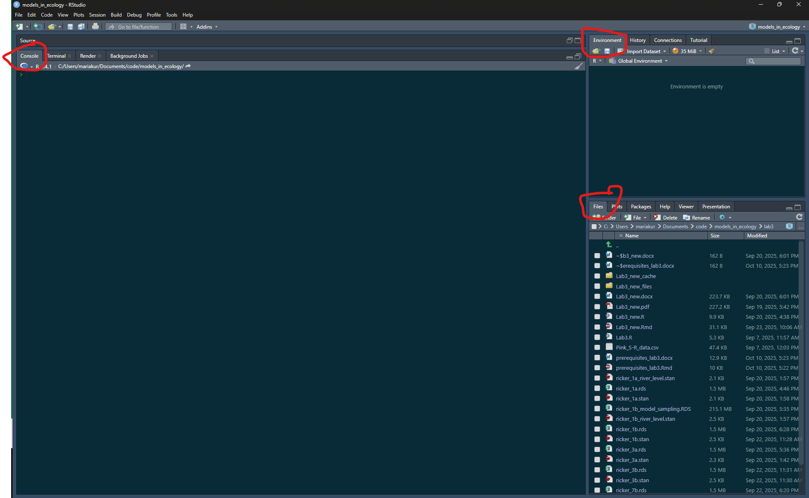
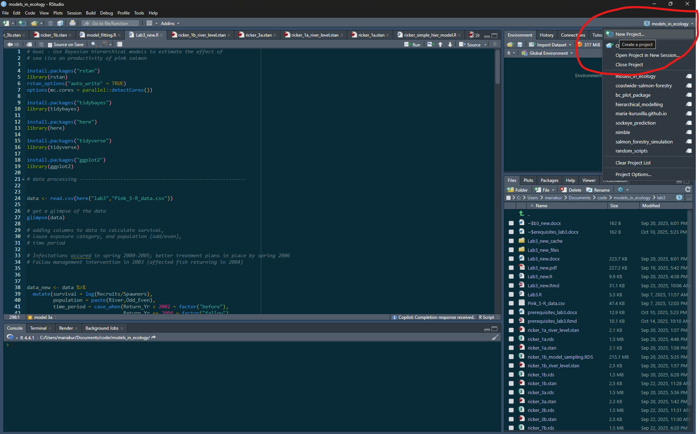
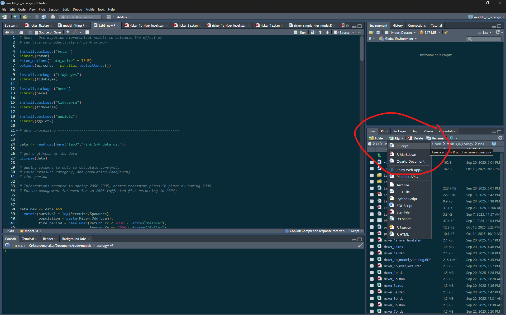

<!-- Make a new document for Lab 3 - redo analysis fromKrkosek and Hilborn 2011 in a Bayesian framework  -->

```{=html}
<style type="text/css">

body{ /* Normal  */
      font-size: 13px;
  }
td {  /* Table  */
  font-size: 13px;
}
h1.title {
  font-size: 24px;
  color: Black;
}
h1 { /* Header 1 */
  font-size: 19px;
  color: Black;
}
h2 { /* Header 2 */
    font-size: 15px;
  color: Black;
}
h3 { /* Header 3 */
    font-size: 15px;
  color: Black;
}
</style>
```


```{r setup, include=FALSE}
knitr::opts_chunk$set(include = TRUE)
knitr::opts_chunk$set(warning = FALSE)
knitr::opts_chunk$set(message = FALSE)
```


### Introduction to effective coding in RStudio

When you open RStudio for the first time, (most of) you will see three windows in following layout:

<!-- add screenshot of Rstudio -->


The large pane on the left is the Console Window. The window on the top right is the Environment / History / Connections pane and the bottom right window is the Files / Plots / Packages / Help / Viewer window. You can customise the location of each pane by clicking on the ‘Tools’ menu then selecting Global Options –> Pane Layout. You can resize the panes by clicking and dragging the middle of the window borders in the direction you want.

#### Using R Projects

It is recommended that your code for this lab and class is within one folder which is also an Rproject for project management. 

Before making a new project, you should copy all the files for this class into a folder/directory and call it models_in_ecology. You can make a new project, by clicking on the 'New Project' option on the top right, and when prompted click on existing directory and redirect Rstudio to the folder/directory. This will create a .Rproj file within the folder. Whenever you open RStudio, you can open this file by clicking on 'Open Project in New Session' and then clicking on this file. This will help you open all the files relevant to this project and set the working directory to this folder location. This folder can have folders within it. For example, you can make a folder called lab3 and put all files related to lab3 within it. 

You can read more about what the advantages of using Rprojects are here - [Why Use
Projects?](https://thedavidchen.github.io/post/rstudio-why-use-projects/)



You can type code into the console directly, but it becomes cumbersome when you have to write a lot of reproducible code. It is better to make a new file (R script) which contains your lines of code. Before making a new file, make sure that the path shown in your 'files' panel in your RStudio is pointing at the folder called models_in_ecology or wherever you want to make the new file. Then click on '+ file' and then choose R Script to make a new .R file, which you can name "lab3_setup.R". 



#### Installing packages


For lab 3, we will use some new packages, namely 'here', 'tidyverse', and 'rstan'. 

First, in the console copy and paste the following line of code:

```{r echo=TRUE, eval=FALSE}

install.packages("here")

```

You can read more about the package [here](https://here.r-lib.org/), which enables easy file referencing. 

Repeat to install "tidyverse":

```{r echo=TRUE, eval=FALSE}

install.packages("tidyverse")

```

Tidyverse is a collection of R packages, such as dplyr and ggplot2, that is useful for data science. We will use it in Lab 3 for data processing and data visualization. 

<!-- Finally, we need to install [Rstan](https://mc-stan.org/rstan/) to fit Bayesian models. This is optional for undergraduate students. -->

<!-- Prior to installing rstan, you need to configure your R installation to be able to compile C++ code. This might look different depending on your operating system, so please use the [following instructions](https://github.com/stan-dev/rstan/wiki/RStan-Getting-Started) for your system. -->

<!-- You can then install the rstan package and run an example model by copying and running the following lines of code: -->

<!-- ```{r echo=TRUE, eval=FALSE} -->
<!-- install.packages("rstan", repos = c('https://stan-dev.r-universe.dev', getOption("repos"))) -->
<!-- example(stan_model, package = "rstan", run.dontrun = TRUE) -->

<!-- ``` -->

<!-- There are additional options in the rstan installation because we are installing a more recent version of the Stan language than the latest official RStan release.  -->

<!-- The example model might take a few minutes to finish running and will print out lines in the console while fitting. These lines should give you information on the number of chains and how many samples have been collected  -->


<!-- ### Fitting mixed-effects models in Stan -->

<!-- For Lab 3, graduate students will use the rstan package to fit a Bayesian mixed-effects (or -->
<!-- hierarchical) model in R. Undergraduate students will have the option to fit a Bayesian mixed-effects (or -->
<!-- hierarchical) model in R, but are not required to. -->

<!-- [Stan](https://mc-stan.org/) is a probabilistic programming language that allows us to run Bayesian statistical models - from simple linear regression to more complicated multi-level models and time-series analysis.  -->

<!-- A Stan program is organized into a sequence of named blocks: -->

<!-- ```{stan output.var="blocks", eval=FALSE, include=TRUE} -->

<!-- functions { -->
<!--   // ... function declarations and definitions ... -->
<!-- } -->
<!-- data { -->
<!--   // ... declarations ... -->
<!-- } -->
<!-- transformed data { -->
<!--    // ... declarations ... statements ... -->
<!-- } -->
<!-- parameters { -->
<!--    // ... declarations ... -->
<!-- } -->
<!-- transformed parameters { -->
<!--    // ... declarations ... statements ... -->
<!-- } -->
<!-- model { -->
<!--    // ... declarations ... statements ... -->
<!-- } -->
<!-- generated quantities { -->
<!--    // ... declarations ... statements ... -->
<!-- } -->

<!-- ``` -->


<!-- All of the blocks are options. Note that comments start with "//" and all lines end with a semicolon ";". -->

<!-- Here is an example of a simple linear regression for one salmon population which can be expressed as $y_t \sim normal(r + b S_t, \sigma)$ where $y_t$ is survival in year $t$, $r$ is the growth rate, $b$ is the density dependence, and $S_t$ is the spawners at year t. Copy the following code into a new stan file (click on new file and then select stan file) within your Rproject and save it as "simple.stan". -->

<!-- You can make a new stan file in the same way as you made a new R script. Click on '+ file' in the bottom right files window and then select 'Stan File'. You can name the first file 'simple.stan' and copy and paste the following code in it. You can check if the code is syntactically correct by clicking on the 'check' button on the top right of the window. If you see this warning "Warning message: In readLines(file, warn = TRUE) :incomplete final line found on 'simple.stan'", then just add an empty line to the end of your code by clicking enter. In order to run this code, we will have to write some lines of code in an R Script.  -->


<!-- ```{stan output.var="simple", eval=FALSE, include=TRUE} -->

<!-- data { -->
<!--   int<lower=0> N; //number of observations or years in this case -->
<!--   vector[N] S; //predictor of size N -->
<!--   vector[N] y; //response variable of size N -->
<!-- } -->
<!-- parameters { -->
<!--   real r; //intercept to be estimated -->
<!--   real b; //slope to be estimated -->
<!--   real<lower=0> sigma; //variance to be estimated -->
<!-- } -->
<!-- model { -->

<!--   r ~ normal(1.2, 2); //prior for intercept, based on literature -->
<!--   b ~ normal(0, 10); //prior for slope -->
<!--   sigma ~ normal(0, 1); //prior for variance -->
<!--   y ~ normal(r + b * S, sigma); // linear model -->
<!-- } -->


<!-- ``` -->


<!-- #### Running Stan code -->

<!-- Download the spawner-recruit "Pink S-R data" as a .csv file. Read those data into R. I have downloaded into a folder called "lab3". The "here" function makes a relative file path to Pink_S-R_data.csv which is within the lab3 folder.  -->

<!-- ```{r data, echo=TRUE} -->
<!-- library(here) -->
<!-- library(tidyverse) -->

<!-- data <- read.csv(here("lab3","Pink_S-R_data.csv")) -->

<!-- # get a glimpse of the data -->
<!-- glimpse(data) -->
<!-- ``` -->


<!-- The Return_Yr is the year that the Recruits came back to spawn, meaning that the Spawners column refers to the spawners that started in year Return_Yr-2.  Area refers to the Department of Fisheries and Oceans statistical management area, which is the spatial scale at which catch data are reported (see http://www.pac.dfo-mpo.gc.ca/fm-gp/maps-cartes/areas-secteurs/index-eng.html).  -->
<!-- Note that because odd and even year returns do not mix and are treated as separate populations, a population is given by a combination of River and Odd_Even. Create a column for population (by combining river and Odd_Even). Then calculate survival as log(Recruits/Spawners).  Create a column for exposure category (by combining exposure and time_period).  Finally, create a column for time series length, start row and end row for each population. We will need this to differentiate the data from different populations in stan. -->

<!-- Now use the unique and the length functions in R to check how many return years, management areas and populations there are in the data frame. -->

<!-- ```{r data_processing, echo = TRUE, include = TRUE} -->

<!-- data_new <- data %>%  -->
<!--   mutate(survival = log(Recruits/Spawners), -->
<!--          population = paste(River,Odd_Even), -->
<!--          time_period = case_when(Return_Yr < 2002 ~ factor("before"), -->
<!--                                  Return_Yr == 2004 ~ factor("fallow"), -->
<!--                                  Return_Yr >= 2002 & Return_Yr <= 2006 ~ factor("during"), -->
<!--                                  Return_Yr > 2006 ~ factor("after")), -->
<!--          exposure = as.factor(ifelse(Area==12, "exposed","unexposed"))) %>%  -->
<!--   mutate(exposure_category = paste(exposure, time_period), -->
<!--          row_number = row_number()) %>%  -->
<!--   # add a column with the start row number and another with the end row number for -->
<!--   # the time series of each population -->
<!--   group_by(population) %>% -->
<!--   mutate(time_series_length = n(), -->
<!--          start_row = first(row_number), -->
<!--          end_row = last(row_number)) %>%  -->
<!--   ungroup() -->


<!-- glimpse(data_new) -->

<!-- ``` -->

<!-- Let us make a subset of the data with one population using the filter function, to fit our simple.stan model. Note the number of rows and columns. -->


<!-- ```{r data_subset, echo = TRUE, include = TRUE} -->

<!-- data_subset <- data_new %>%  -->
<!--   filter(population == "Embly 2") -->

<!-- glimpse(data_subset) -->

<!-- ``` -->
<!-- Now we need to call the stan model and give it a name within the R Script. Here I am calling it ricker_simple_model and using the stan_model() function to call the stan model. It might take a minute to run. Then we need to make a data list for the first block of the stan model. Make sure the variables match the variables in the data block of the stan code. We then draw samples from the posterior distribution by using the sampling() function. This function has inputs which are the stan model and the data we provide. We can also specify the number of chains we want to use, how many samples or iterations (iter) we want, and how many warmup iterations to use. In this context, chains refer to the sequence of samples from the distribution. We usually want more than 1 chain which start at different points to make sure that all chains converge to the same posterior distribution after multiple iterations. We also discard the first 1000 samples (warmup) because we do not want to make inference from these samples, which might be influenced by the starting values of the parameters in the chains.  -->

<!-- This might take ~2 minutes to run. -->


<!-- ```{r simple_run, eval = TRUE, include = TRUE, cache=TRUE} -->

<!-- # call model -->

<!-- library(rstan) -->
<!-- ricker_simple_model <- stan_model(file = here("lab3","simple.stan")) -->


<!-- # create data list for model  -->

<!-- data_list_simple <- list( -->
<!--   N = nrow(data_subset), -->
<!--   S = data_subset$Spawners, -->
<!--   y = data_subset$survival -->
<!-- ) -->

<!-- # options for rstan -->
<!-- rstan_options("auto_write" = TRUE) -->

<!-- # runs the chains in parallel -->
<!-- options(mc.cores = parallel::detectCores()) -->

<!-- # sample from model -->
<!-- ricker_simple_model_sampling <- rstan::sampling(ricker_simple_model, -->
<!--                                             data = data_list_simple, -->
<!--                                             chains = 4, -->
<!--                                             iter = 3000, -->
<!--                                             warmup = 1000) -->
<!-- ``` -->

<!-- We can assess convergence by looking at the chains/sequence of samples. The chains should resemble a hairy catterpillar. These chains don't look so good because we don't have a lot of data. This leads us to using multi-stock model with data from several populations by accounting for random effects in Lab 3. -->


<!-- ```{r fig.width=8, fig.height=6} -->

<!-- # check trace plots to look for caterpillar like sampling plots -->

<!-- bayesplot::mcmc_trace(ricker_simple_model_sampling, pars = "r") -->

<!-- # plot posterior probability distribution -->
<!-- bayesplot::mcmc_areas(ricker_simple_model_sampling, pars = c("r")) -->


<!-- ``` -->


<!-- Here are the list of packages we will be using for this lab. You can use the following code to check whether you have already installed these packages and to install them, if not. Then load the packages to use them. -->

<!-- ```{r packages, include=TRUE, echo = TRUE, results = 'hide'} -->

<!-- list.of.packages <- c("ggplot2", "tidyverse", "here", "tidybayes") -->

<!-- new.packages <- list.of.packages[!(list.of.packages %in% installed.packages()[,"Package"])] -->

<!-- if(length(new.packages)) install.packages(new.packages) -->

<!-- #load packages  -->
<!-- library(rstan) -->
<!-- rstan_options("auto_write" = TRUE) -->
<!-- options(mc.cores = parallel::detectCores()) -->
<!-- library(tidybayes) -->
<!-- library(here) -->
<!-- library(tidyverse) -->
<!-- library(ggplot2) -->


<!-- ``` -->


<!-- ### Background on stock-recruit models -->

<!-- Stock-recruit models describe the relationship between the abundance of fish that spawned of population i and at time step t-2 ($N_{i,t-2}$) and the number of offspring that survive to "recruit" into the next generation (2 years later for Pink salmon) of population i and at time step t ($R_{i,t}$). The following equation is the Ricker model, which has been used to describe salmon population dynamics before.  -->

<!-- $$R_{i,t} = N_{i,t-2} e^{(r - b_{i} N_{i,t-2} + \epsilon_{i,t})}$$ -->
<!-- $r$ is the population growth rate, $b_{i}$ is the strength of density dependence for population i, and $\epsilon_{i,t}$ is a normally distributed error term with mean 0 and standard deviation $\sigma$. -->

<!-- The linear form of the Ricker model is given by: -->

<!-- $$ln(R_{i,t}/N_{i,t-2}) = r - b_{i} N_{i,t-2} + \epsilon_{i,t}$$ -->
<!-- This is similar to a simple linear regression where $r$ is the intercept of the line, $b$ is the slope, and $N$ is the fixed effect. -->


<!-- Download the spawner-recruit "Pink S-R data" as a .csv file. Read those data into R. I have downloaded into a folder called "lab3". -->

<!-- ```{r data, echo=TRUE} -->


<!-- data <- read.csv(here("lab3","Pink_S-R_data.csv")) -->

<!-- # get a glimpse of the data -->
<!-- glimpse(data) -->
<!-- ``` -->


<!-- The Return_Yr is the year that the Recruits came back to spawn, meaning that the Spawners column refers to the spawners that started in year Return_Yr-2.  Area refers to the Department of Fisheries and Oceans statistical management area, which is the spatial scale at which catch data are reported (see http://www.pac.dfo-mpo.gc.ca/fm-gp/maps-cartes/areas-secteurs/index-eng.html).  -->
<!-- Note that because odd and even year returns do not mix and are treated as separate populations, a population is given by a combination of River and Odd_Even. Create a column for population (by combining river and Odd_Even). Then calculate survival as log(Recruits/Spawners).  Create a column for exposure category (by combining exposure and time_period).  Finally, create a column for time series length, start row and end row for each population. We will need this to differentiate the data from different populations in stan. -->


<!-- ```{r data_processing, echo = TRUE, include = TRUE} -->

<!-- data_new <- data %>%  -->
<!--   mutate(survival = log(Recruits/Spawners), -->
<!--          population = paste(River,Odd_Even), -->
<!--          time_period = case_when(Return_Yr < 2002 ~ factor("before"), -->
<!--                                  Return_Yr == 2004 ~ factor("fallow"), -->
<!--                                  Return_Yr >= 2002 & Return_Yr <= 2006 ~ factor("during"), -->
<!--                                  Return_Yr > 2006 ~ factor("after")), -->
<!--          exposure = as.factor(ifelse(Area==12, "exposed","unexposed"))) %>%  -->
<!--   mutate(exposure_category = paste(exposure, time_period), -->
<!--          row_number = row_number()) %>%  -->
<!--   # add a column with the start row number and another with the end row number for -->
<!--   # the time series of each population -->
<!--   group_by(population) %>% -->
<!--   mutate(time_series_length = n(), -->
<!--          start_row = first(row_number), -->
<!--          end_row = last(row_number)) %>%  -->
<!--   ungroup() -->


<!-- glimpse(data_new) -->

<!-- ``` -->


<!-- You can visualize the data using the following code. Since there are many populations, we can group the plots by area. -->


<!-- ```{r plot_data, echo=TRUE, fig.width = 10, fig.height = 10} -->


<!-- ggplot(data_new, aes(x = Return_Yr, y = survival, group = population))+ -->
<!--   geom_point(alpha = 0.8, aes(color = exposure_category))+ -->
<!--   geom_line(aes(color = exposure_category), alpha = 0.6, size = 1.2)+ -->
<!--   geom_vline(xintercept = 2002, linetype = "dashed", color = "darkred")+ -->
<!--   facet_wrap(~paste("Area:",Area), ncol = 1, scales = "free_y") + -->
<!--   scale_color_manual(values = c("exposed before" = "lightblue", -->
<!--                                 "exposed during" = "darkred",  -->
<!--                               "exposed after" = "darkblue",  -->
<!--                               "exposed fallow" = "violet", -->
<!--                               "unexposed before" = "lightblue",  -->
<!--                               "unexposed during" = "lightblue", -->
<!--                               "unexposed after" = "lightblue",  -->
<!--                               "unexposed fallow" = "lightblue")) + -->
<!--   theme_classic()+ -->
<!--   theme(strip.background = element_blank(), -->
<!--         legend.position = "none") +  -->
<!--   labs(title = "Pink Salmon Survival vs Return Year", -->
<!--        x = "Return Year", -->
<!--        y = "Survival (log(Recruits/Spawners))", -->
<!--        color = "Exposure Category") -->
<!-- ``` -->


